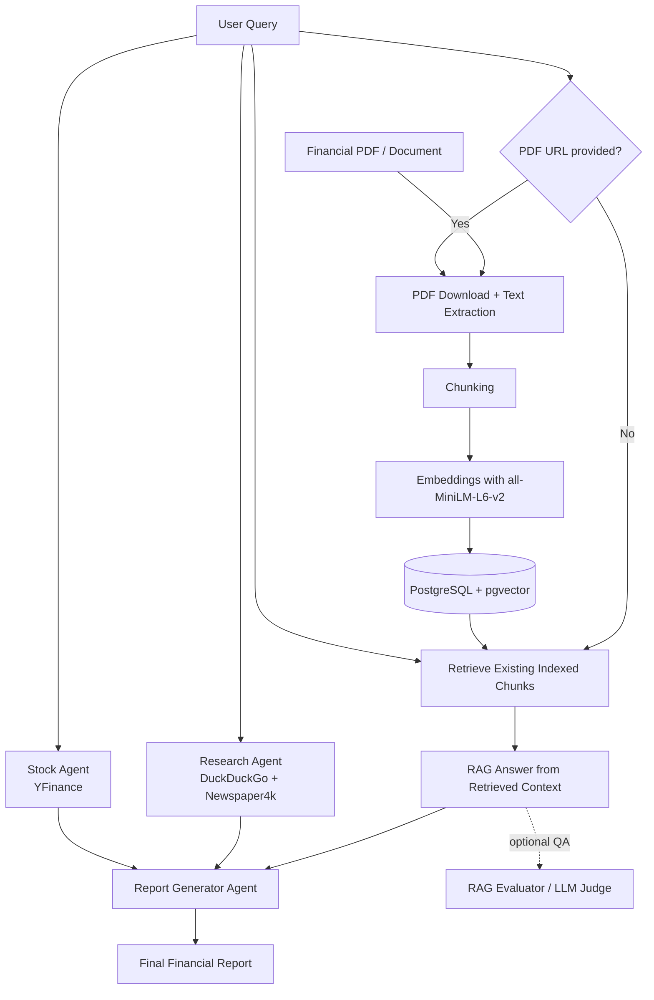

# Finance_AI_Agent
A modular multi-agent financial analysis pipeline built in a notebook environment.  
This project combines:

- **RAG over financial documents** using PostgreSQL + pgvector
- **Web research** for external market context
- **Stock/market enrichment** with live market tools
- **LLM-based report generation**
- **Optional RAG evaluation** with an LLM judge

The goal is to turn a user’s financial question into a structured, evidence-aware report that blends **internal document evidence** with **external market intelligence**.

---

## Project Overview

This notebook implements a financial analysis workflow with four main components:

1. **RAG Layer**
   - Downloads a financial PDF
   - Extracts text
   - Chunks the content
   - Embeds chunks with `sentence-transformers`
   - Stores vectors in **PostgreSQL + pgvector**
   - Retrieves the most relevant chunks for a user query

2. **Research Agent**
   - Uses web search tools to gather current external information
   - Focuses on quantitative, source-based financial context
   - Produces structured market intelligence

3. **Stock/Market Agent**
   - Uses market data tools to enrich the analysis
   - Adds price, valuation, and company-level metrics when relevant

4. **Report Generator Agent**
   - Synthesizes:
     - internal document context
     - external research context
     - stock/market enrichment
   - Produces a professional final report

An additional **RAG Evaluator** is included to assess retrieval and answer quality.

---

## Architecture



---

## Notebook Workflow

### 1. Environment Setup
The notebook installs and configures:

- `groq`
- `ddgs`
- `psycopg` / `psycopg2`
- `sqlalchemy`
- `sentence-transformers`
- PostgreSQL
- pgvector

It also loads API keys from **Google Colab userdata**.

### 2. Research Agent
The research agent is configured to:
- search authoritative sources
- prioritize recent and numerical information
- build quantitative market summaries
- generate scenario-based analysis

### 3. RAG Pipeline
The RAG section:
- creates a PostgreSQL table for document chunks
- downloads a PDF from a URL
- extracts text with `pypdf`
- chunks the text
- embeds the chunks
- stores vectors in pgvector
- retrieves top-k relevant chunks for a user question
- answers strictly from retrieved context

### 4. Market Research / Stock Agent
The stock agent uses financial tooling to provide:
- latest stock information
- 52-week range
- valuation metrics
- market context and risk framing

### 5. Evaluation
A lightweight LLM judge evaluates RAG quality using:
- faithfulness
- context relevance
- completeness
- source attribution
- coherence

### 6. Final Pipeline
The `run_financial_pipeline()` function orchestrates the full process:
- optional PDF indexing
- retrieval and RAG answer generation
- web research
- stock enrichment
- final report generation

---

## Tech Stack

- **Python**
- **Google Colab**
- **PostgreSQL**
- **pgvector**
- **Groq LLMs**
- **Agno agents**
- **Sentence Transformers**
- **DuckDuckGo search**
- **Newspaper4k**
- **Yahoo Finance tools**

---

## Example Usage

```python
result = run_financial_pipeline(
    user_query="Analyze the main financial risks and market implications mentioned in this report",
    pdf_url="https://example.com/financial_report.pdf",
    top_k=5
)

print(result["final_report"])
```
---

## Output Structure

The pipeline returns a dictionary with:

```python
{
    "user_query": ...,
    "rag_context": ...,
    "research_context": ...,
    "stock_context": ...,
    "final_report": ...
}
```
---

## Why This Project Matters

This project demonstrates a practical way to orchestrate these capabilities inside a single AI workflow.

---

## Author

**Rachid AIT JALLOUL**

Notebook project focused on financial document intelligence, market research, and AI-powered reporting.
